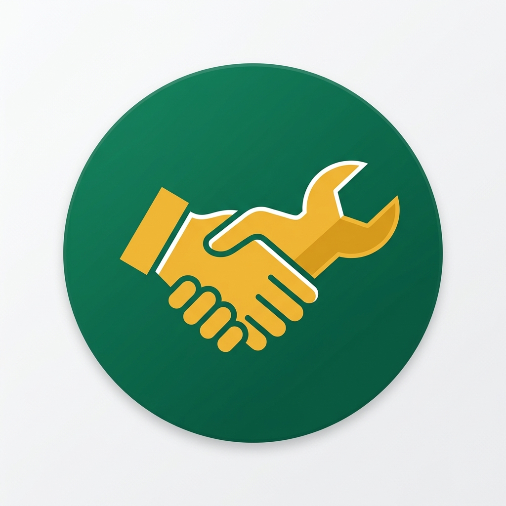

# NexServ — AI-Powered Cooperative Gig Services Platform 🤝⚙️

<div align="center">
  
</div>
<br>

<div align="center">
  
</div>

## 📌 Project Overview
**NexServ** is a modern, production-grade Flutter application designed for an AI-Powered Cooperative Gig Services Platform. Built with Material 3 design principles, it seamlessly connects customers with verified cooperative gig workers (electricians, plumbers, cleaners, etc.) while providing cooperative administrators with powerful oversight tools.

This prototype was built specifically to demonstrate a robust, scalable, and highly accessible ecosystem for gig workers, prioritizing **welfare, fair pay, and AI-driven efficiency**.

## ✨ Key Features

### 🏢 Multi-Role Architecture
A single, unified codebase serving three distinct user experiences:
- **🛠️ Worker Portal:** Go online/offline, receive AI-driven demand heatmaps (surge zones), accept incoming jobs, and generate transparent bills with automatic cooperative welfare deductions.
- **🏠 Customer Portal:** Book services via a modern UI, track workers in real-time on a map, and utilize voice accessibility features.
- **📊 Admin Dashboard:** Monitor live platform activity, track cooperative welfare funds, verify worker IDs, and oversee AI-driven demand forecasting heatmaps.

### ♿ Accessibility & Inclusivity First
- **Multilingual Support:** Instant toggle between English and Hindi across the entire application to cater to diverse digital literacy levels.
- **Voice Assistance:** Integrated voice prompt simulators for low-literacy users.

### 🛡️ Secure & Transparent
- **OTP Verification:** Workers must verify a 4-digit OTP from the customer before starting a job.
- **Welfare Pool Tracking:** Transparent 3% deduction from jobs directed into a cooperative welfare fund, visible to both workers and admins in real-time.

## 🛠️ Technology Stack
- **Framework:** [Flutter](https://flutter.dev/) (Dart)
- **UI/UX:** Material 3 Design System
- **State Management:** Provider (`MultiProvider`, `ChangeNotifier`)
- **Routing:** Centralized named routing via `AppRoutes` and `NavigatorKey`

## 🚀 How to Run Locally

### Prerequisites
- [Flutter SDK](https://docs.flutter.dev/get-started/install) installed.
- Android Studio / VS Code with Flutter plugins.
- An Android Emulator or a physical device connected via USB/Wi-Fi.

### Installation Steps

1. **Clone the repository:**
   ```bash
   git clone https://github.com/your-username/NexServ.git
   cd NexServ
   ```

2. **Get dependencies:**
   ```bash
   flutter pub get
   ```

3. **Run the app:**
   ```bash
   flutter run
   ```

4. **Build for Android (Release APK):**
   ```bash
   flutter build apk --release --split-per-abi
   ```
   *The optimized APKs will be generated in `build/app/outputs/flutter-apk/`.*

## 📸 Demonstration
During a presentation, use the **Floating Action Button (FAB)** in the bottom right corner of the screen to instantly switch between Customer, Worker, and Admin roles to demonstrate the reactive global state synchronization.

---
*Built with ❤️ for the Smart India Hackathon (SIH).*
